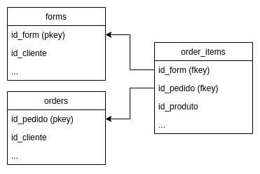

  

---

  <h1>⚗️ JustForYou Data Science Challenge</h1>

Primeiramente, obrigado pelo seu interesse em trabalhar na JustForYou! Abaixo você encontrará todas as informações necessárias para iniciar o seu teste.

## 💡 Avisos antes de começar

* Crie um repositório na sua conta do GitHub sem citar nada relacionado a JustForYou;
* Faça seus commits no seu repositório;
* Compartilhe com a justfor-br (username do Github do avaliador rftemer), assim você poderá dar permissão de leitura no código; 
* Fique tranquilo(a), respire, assim como você, também já passamos por essa etapa. Boa sorte! :)

## ❓ Desafio

### Contextualização
Você trabalha em uma empresa do tipo e-commerce que vende produtos para cabelo personalizados.
Para personalizar o produto, a empresa solicita que o cliente preencha um formulário onde
irá contar sobre a sua rotina e seu cabelo. Após finalizar o preenchimento, o cliente é
direcionado automaticamente para o checkout, onde ele irá optar por fechar a compra ou não.
 
A experiência de venda online é baseada em três etapas:
 
<ul>
    <li> Preenchimento do formulário </li>
    <li> Seleção dos produtos </li>
    <li> Fechamento da compra </li>
</ul>

### Problema e desafio
A empresa está gastando muito dinheiro com disparos via Whatsapp para pessoas que preenchem o formulário (leads), 
desta forma seria interessante qualificar quem são os leads que possuem maior probabilidade de efetuar uma compra
e assim tornar os disparos mais efetivos.
 
 
Você então é convocado para solucionar tal desafio, e portanto deve <b> achar a correlação entre compradores e leads.</b>
 
Para isso, acesse o banco de dados presente em sua empresa para fazer a coleta dos dados, e use os recursos ao seu alcance para solucionar o problema e apresentar as suas conclusões.

### Recursos
Sua empresa contém um banco de dados relacional (Postgres) hospedado remotamente, com as credenciais de acesso listadas [aqui](db_access.txt). O banco contém a seguinte estrutura de tabelas e relações:

    

### Entregas
A entrega deve conter um arquivo .ipynb (Jupyter notebook) contendo toda evolução da solução, sendo que os seguintes pontos devem estar presentes:
<ol>
    <li>Leitura dos dados e normalização </li>
    <li>Separação de bases para treinar e efetuar o crossvalidation </li>
    <li>Respaldo teórico e prático sobre as escolhas dos algoritmos (podendo ser mais de um)</li>
    <li>Como e porquê foram escolhidas as features analisadas</li>
    <li>Salvar o arquivo de treinamento para uma API consumir e gerar o score</li>
    <li>Resultado final com métricas de acertividade do algoritmo</li>
</ol>
 

Devem constar em seu repositório git:
<ul>
    <li>Arquivo .ipynb citado acima</li>
    <li>Arquivo .md contendo as conclusões de sua análise</li>
    <li>Arquivo .sql contendo as <i>queries</i> utilizadas para obtenção dos dados</li>
    <li>Scripts extras utilizados para as análises, caso tenha utilizado algum</li>
</ul>
